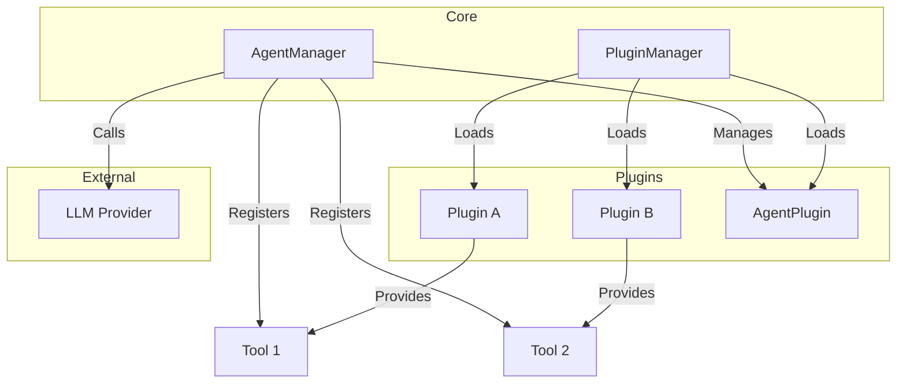

# Architecture Overview

ArteCore is designed as a modular framework where the core system provides management capabilities, and functionality is extended through plugins.

## Core Components

### AgentManager

The `AgentManager` (`src/artreactor/core/managers/agent_manager.py`) is the central orchestrator for AI agents. Its primary responsibilities include:

-   **Agent Initialization**: Initializes the default agent (e.g., Gemini) using the `smolagents` library.
-   **Tool Management**: Maintains a registry of available tools (`ServiceTool`) and exposes them to agents.
-   **Plugin Integration**: Registers tools provided by loaded plugins.
-   **Agent Lifecycle**: Manages specialized agents defined by `AgentPlugin` implementations.
-   **Execution**: Handles the execution of agent runs, injecting context and managing the conversation loop.

### PluginManager

The `PluginManager` (`src/artreactor/core/managers/plugin_manager.py`) handles the extensibility of the framework. Its responsibilities are:

-   **Discovery**: Scans the `src/artreactor/plugins` directory for valid plugins.
-   **Configuration**: Reads `plugin.toml` manifests to understand plugin metadata (name, version, type).
-   **Loading**: Dynamically imports plugin modules and instantiates `Plugin` classes.
-   **Tool Scanning**: Inspects loaded plugins for methods decorated with `@tool` and registers them as available tools.
-   **Lifecycle Management**: Handles initialization (`initialize()`) and shutdown (`shutdown()`) of plugins.

## Component Diagram

## Data Flow

1.  **Startup**: The application starts, and `PluginManager` discovers and loads all plugins.
2.  **Registration**: `AgentManager` requests tools from `PluginManager` and registers them.
3.  **Request**: A user sends a request (prompt) to the system.
4.  **Execution**: `AgentManager` selects the appropriate agent.
5.  **Tool Use**: The agent may decide to call a tool. `AgentManager` executes the tool (which may be a method in a Plugin).
6.  **Response**: The agent generates a response using the LLM and tool outputs.
