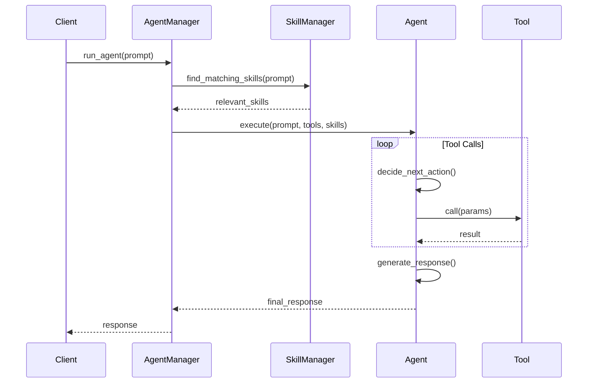
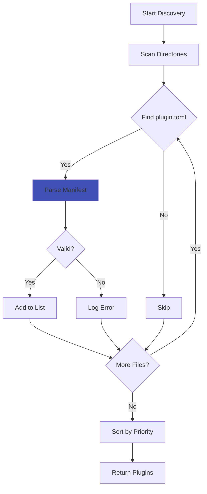
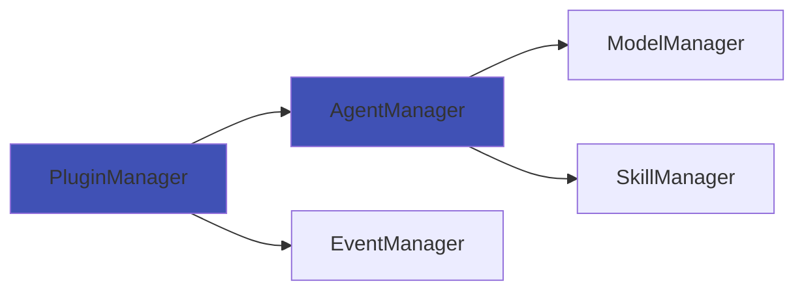
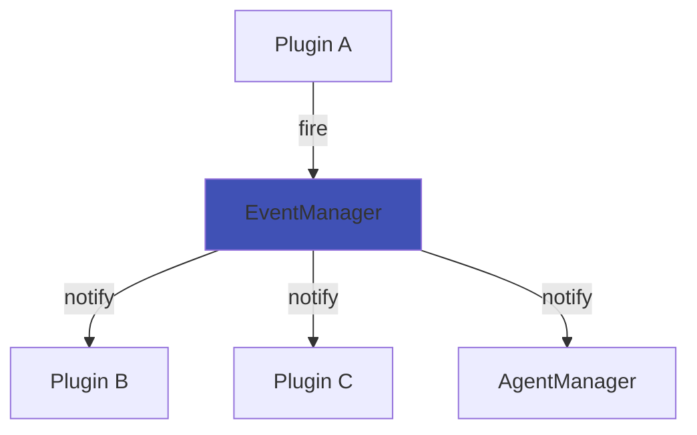
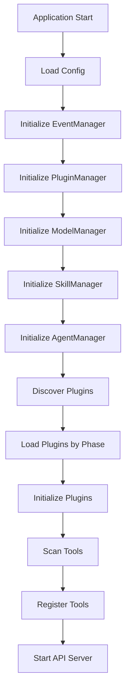

# Core Components

ArtReactor's core components form the foundation of the framework. Understanding these is essential for advanced plugin development.

## AgentManager

**Location**: `artreactor/core/managers/agent_manager.py`

The AgentManager orchestrates AI agents and their interactions with tools.

### Responsibilities

- **Agent Lifecycle**: Initialize and manage agent instances
- **Tool Registry**: Maintain a registry of available tools
- **Execution**: Run agent prompts and handle tool calls
- **Context Management**: Inject context (Skills, configuration) into agent execution
- **Model Integration**: Interface with LLM providers via litellm

### Key Methods

```python
class AgentManager:
    async def initialize(self) -> None:
        """Initialize the default agent and load tools."""
        
    def register_tool(self, tool: Tool) -> None:
        """Register a tool for use by agents."""
        
    async def run_agent(
        self, 
        prompt: str, 
        agent_type: str = "default"
    ) -> AgentResponse:
        """Execute an agent with the given prompt."""
        
    def get_tools_for_agent(self, agent_type: str) -> List[Tool]:
        """Get tools available to a specific agent type."""
```

### Tool Discovery Flow

1. PluginManager discovers `@tool` decorated methods
2. Methods are wrapped as `ServiceTool` instances
3. ServiceTools are registered with AgentManager
4. AgentManager exposes tools to appropriate agents

### Agent Execution Flow



## PluginManager

**Location**: `artreactor/core/managers/plugin_manager.py`

The PluginManager handles the complete lifecycle of plugins.

### Responsibilities

- **Discovery**: Find plugins in configured directories
- **Manifest Parsing**: Read and validate `plugin.toml` files
- **Loading**: Dynamically import and instantiate plugins
- **Tool Scanning**: Find `@tool` decorated methods in plugins
- **Lifecycle**: Call `initialize()` and `shutdown()` methods
- **Dependency Resolution**: Load plugins in correct order

### Key Methods

```python
class PluginManager:
    async def discover_plugins(self) -> List[PluginManifest]:
        """Scan directories and parse manifests."""
        
    async def load_plugin(self, manifest: PluginManifest) -> Plugin:
        """Import module and instantiate plugin class."""
        
    def scan_tools(self, plugin: Plugin) -> List[Tool]:
        """Find and wrap @tool decorated methods."""
        
    async def initialize_plugins(self) -> None:
        """Initialize all plugins in priority order."""
        
    async def shutdown_plugins(self) -> None:
        """Shutdown all plugins in reverse order."""
        
    def get_plugin(self, name: str) -> Optional[Plugin]:
        """Retrieve a loaded plugin by name."""
```

### Plugin Loading Phases

Plugins load in phases based on their `timing.phase`:

1. **pre-init**: Core infrastructure (logging, telemetry)
2. **default**: Standard plugins (most plugins)
3. **post-init**: Plugins that depend on others

Within each phase, plugins load by priority (higher first).

### Plugin Discovery



## ModelManager

**Location**: `artreactor/core/managers/model_manager.py`

Manages AI model configurations and connections.

### Responsibilities

- **Provider Configuration**: Manage API keys and settings for LLM providers
- **Model Registry**: Track available models
- **Client Creation**: Instantiate LLM clients
- **Fallback Handling**: Switch to backup models on failure

### Key Methods

```python
class ModelManager:
    def register_model(
        self, 
        name: str, 
        provider: str, 
        config: dict
    ) -> None:
        """Register a model configuration."""
        
    def get_model(self, name: str) -> ModelConfig:
        """Retrieve model configuration."""
        
    async def create_client(self, model_name: str) -> LLMClient:
        """Create a client for the specified model."""
```

### Supported Providers

- OpenAI (GPT-4, GPT-3.5)
- Anthropic (Claude)
- Google (Gemini)
- Local models via Ollama
- Any provider supported by litellm

## EventManager

**Location**: `artreactor/core/events/`

Provides a high-performance event system for decoupled communication.

### Responsibilities

- **Event Registration**: Track event definitions
- **Listener Management**: Maintain listener registry
- **Event Firing**: Notify all listeners when events occur
- **Async Support**: Handle both sync and async listeners

### Key Functions

```python
from artreactor.core.events import event, on, fire, off

@event
class AssetExported:
    """Fired when an asset is exported."""
    path: str
    format: str

# Register listener
@on("asset.exported")
async def process_export(data: dict):
    print(f"Asset exported to {data['path']}")

# Fire event
fire("asset.exported", {"path": "/path/to/asset.fbx", "format": "fbx"})

# Unregister
off("asset.exported", process_export)
```

### Performance Characteristics

- **Listener Capacity**: 1M+ listeners
- **Event Throughput**: 100k+ events/second
- **Async**: Non-blocking event firing
- **Memory**: O(1) per listener

## SkillManager

**Location**: `artreactor/core/managers/skill_manager.py`

Manages Agent Skills for contextual tool discovery.

### Responsibilities

- **Skill Loading**: Parse SKILL.md files from plugins
- **Keyword Indexing**: Build searchable index of skills
- **Context Matching**: Find skills relevant to a prompt
- **Skill Injection**: Add skill documentation to agent context

### Key Methods

```python
class SkillManager:
    def register_skill(
        self, 
        plugin_name: str, 
        skill: Skill
    ) -> None:
        """Register a skill from a plugin."""
        
    def find_matching_skills(
        self, 
        context: str, 
        max_skills: int = 5
    ) -> List[Skill]:
        """Find skills matching the context keywords."""
        
    def get_skill_context(self, skills: List[Skill]) -> str:
        """Generate context string from skills."""
```

### Skill Matching Algorithm

1. Extract keywords from user prompt
2. Score each skill based on keyword matches
3. Rank skills by score
4. Return top N skills
5. Inject skill documentation into agent context

## DatabaseManager

**Location**: `artreactor/core/managers/database_manager.py`

Provides simple key-value and document storage.

### Responsibilities

- **Storage**: Persist plugin data
- **Querying**: Find and retrieve records
- **Indexing**: Fast lookups
- **Schema**: Flexible document structure

See [Database Manager](../advanced/database-manager.md) for details.

## Component Communication

### Direct Dependencies



### Event-Based Communication



## Context Object

Plugins receive a `context` dict during initialization:

```python
context = {
    "plugin_manager": plugin_manager,
    "agent_manager": agent_manager,
    "model_manager": model_manager,
    "event_manager": event_manager,
    "skill_manager": skill_manager,
    "config": config_dict,
    "logger": logger_instance
}
```

Access in plugins:

```python
class MyPlugin(CorePlugin):
    async def initialize(self):
        # Get other managers
        agent_mgr = self.context["agent_manager"]
        config = self.context["config"]
        
        # Use them
        agent_mgr.register_tool(my_tool)
```

## Initialization Order



## Best Practices

### For Plugin Developers

1. **Don't Store Manager References**: Use context when needed
2. **Use Events for Cross-Plugin Communication**: Avoid direct dependencies
3. **Register Tools Early**: Do it in `initialize()`
4. **Clean Up**: Release resources in `shutdown()`

### For Core Contributors

1. **Keep Managers Focused**: Single responsibility
2. **Async by Default**: All I/O should be async
3. **Type Hints**: Full typing for better IDE support
4. **Error Handling**: Graceful degradation, never crash

## Extending Core Components

### Adding a New Manager

1. Create `artreactor/core/managers/my_manager.py`
2. Implement initialization and shutdown
3. Add to application context
4. Update manager initialization order
5. Document in this file

### Modifying Existing Managers

1. Check if it can be done via plugin instead
2. If core change needed, update interfaces first
3. Maintain backward compatibility
4. Add deprecation warnings for breaking changes
5. Update documentation

## Testing Core Components

```python
# Example: Testing AgentManager
import pytest
from artreactor.core.managers.agent_manager import AgentManager
from tests.mocks import MockModel

@pytest.mark.asyncio
async def test_agent_manager_initialization():
    context = {
        "model_manager": MockModel(),
        "config": {}
    }
    manager = AgentManager(context)
    await manager.initialize()
    
    assert manager.is_initialized
    assert len(manager.tools) == 0

@pytest.mark.asyncio
async def test_register_tool():
    manager = AgentManager({})
    
    @tool(name="test_tool")
    def my_tool():
        return "result"
    
    manager.register_tool(my_tool)
    assert "test_tool" in manager.tools
```

## Next Steps

- [Plugin System](plugin-system.md) - How plugins interact with managers
- [Event System](event-system.md) - Deep dive into events
- [Data Flow](data-flow.md) - How data moves through components
