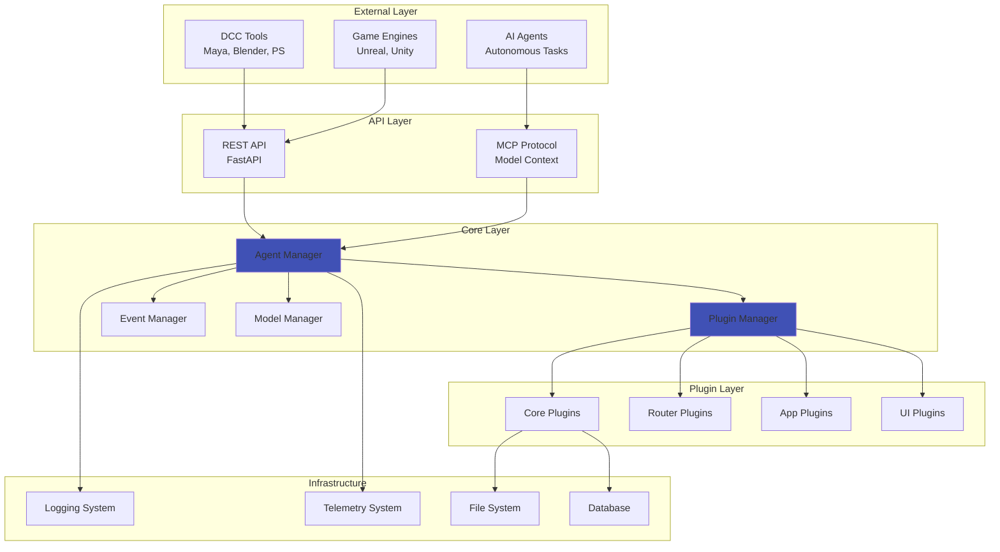
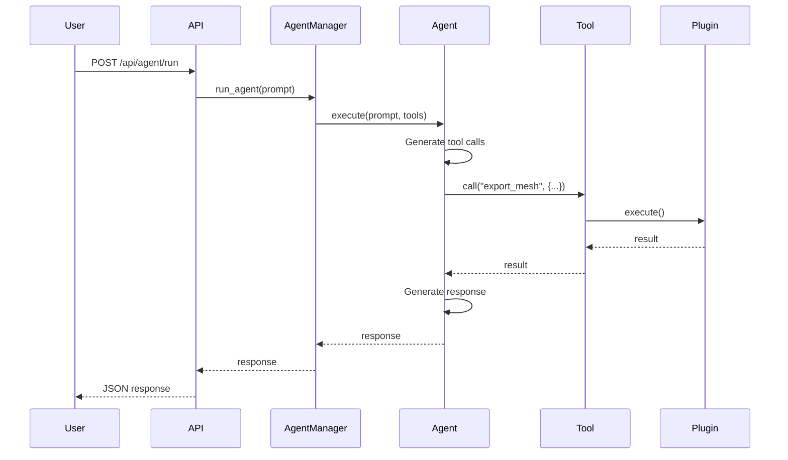
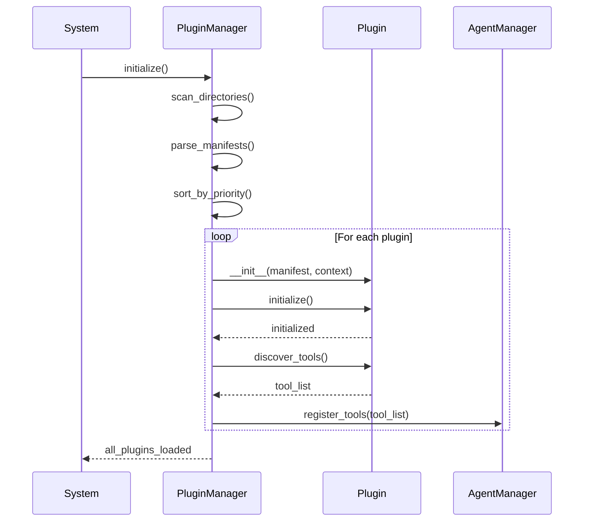
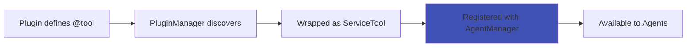
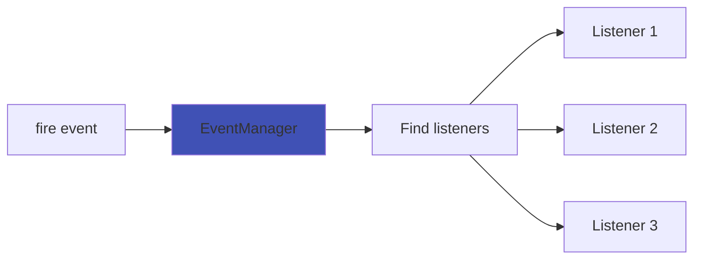
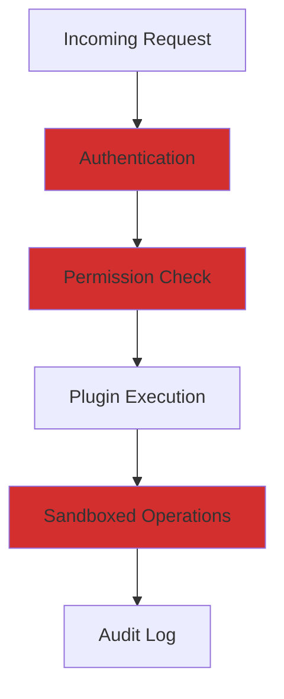

# Architecture Overview

ArtReactor Core is built on a modular, plugin-based architecture designed for extensibility, security, and performance in game asset pipeline workflows.

## Design Philosophy

### 1. Modularity First

Every feature is implemented as a plugin. The core provides only:

- Plugin discovery and lifecycle management
- Event system for decoupled communication
- Agent orchestration and tool registry
- HTTP API foundation

This ensures that features can be added, removed, or replaced without touching core code.

### 2. AI as a First-Class Citizen

Agents are not an afterthought—they're central to the architecture:

- Tools are automatically discovered and exposed to agents
- Agent Skills provide contextual documentation
- Natural language interfaces are prioritized
- Tool calling is type-safe and validated

### 3. Security by Design

Every operation goes through permission checks:

- Plugins declare required permissions
- File operations are sandboxed
- API keys are never logged
- Cross-origin requests are controlled

### 4. Performance Matters

Game pipelines process large assets:

- Async I/O throughout
- Event system handles 100k+ events efficiently
- Lazy loading of plugins
- Optimized for batch operations

## High-Level Architecture



## Core Principles

### Single Responsibility

Each component has one clear purpose:

- **AgentManager**: Orchestrates AI agents and tool execution
- **PluginManager**: Discovers, loads, and manages plugins
- **EventManager**: Routes events between components
- **ModelManager**: Manages AI model connections

### Dependency Inversion

Components depend on interfaces, not implementations:

```python
# Core depends on interface
class AgentManager:
    def register_tool(self, tool: Tool):
        pass

# Plugin implements interface
class MyPlugin(CorePlugin):
    @tool(name="my_tool")
    def my_tool(self):
        pass  # AgentManager doesn't know about MyPlugin
```

### Event-Driven Communication

Components communicate through events, not direct calls:

```python
# Plugin A fires an event
fire("asset.exported", {"path": "/path/to/asset.fbx"})

# Plugin B listens independently
@on("asset.exported")
async def handle_export(data):
    # Process the export
    pass
```

## Request Flow

### Agent Request Flow



### Plugin Loading Flow



## Component Interactions

### Tool Registration



### Event Propagation



## Key Architectural Decisions

### Why Plugins Over Extensions?

**Decision**: Use a plugin architecture rather than simple extensions.

**Rationale**:
- Plugins can be disabled without code changes
- Clear boundaries and ownership
- Independent testing and versioning
- Security isolation

### Why FastAPI?

**Decision**: Use FastAPI as the HTTP framework.

**Rationale**:
- Async support is native
- Automatic API documentation (OpenAPI)
- Type validation with Pydantic
- High performance
- Modern Python patterns

### Why Event System Over Direct Coupling?

**Decision**: Use events for inter-plugin communication.

**Rationale**:
- Plugins don't need to know about each other
- Features can be added/removed without breaking others
- Easier testing (mock event listeners)
- Natural audit trail

### Why PydanticAI?

**Decision**: Use PydanticAI for agent framework.

**Rationale**:
- Type-safe tool definitions
- Multiple LLM provider support
- Structured outputs with validation
- Async-first design
- Pythonic API

## Scalability Considerations

### Horizontal Scaling

ArtReactor can run multiple instances:

- Stateless design (except for local file operations)
- Shared configuration via file or network storage
- Load balancer in front for distribution

### Plugin Isolation

Plugins run in the same process but are isolated:

- Separate namespaces
- Permission boundaries
- Resource limits (future)

### Performance Optimization

- **Lazy Loading**: Plugins load only when needed
- **Async I/O**: Non-blocking file and network operations
- **Caching**: Frequently used data is cached
- **Batch Processing**: Support for processing multiple items

## Security Architecture



### Defense in Depth

1. **API Layer**: Authentication and rate limiting
2. **Manager Layer**: Permission validation
3. **Plugin Layer**: Sandboxed file/network access
4. **Audit Layer**: All operations logged

## Next Steps

Explore specific components:

- [Core Components](core-components.md) - Detailed manager documentation
- [Plugin System](plugin-system.md) - How plugins work
- [Event System](event-system.md) - Event-driven architecture
- [Data Flow](data-flow.md) - How data moves through the system
