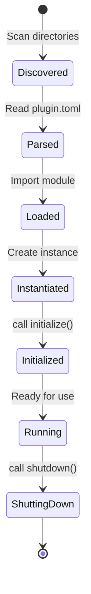

# Plugin System

The plugin system is the primary extensibility mechanism in ArtReactor. This document explains how plugins work internally.

## Plugin Lifecycle



### 1. Discovery

PluginManager scans configured directories for `plugin.toml` files:

```python
def discover_plugins(self) -> List[Path]:
    plugin_paths = []
    for directory in self.plugin_dirs:
        for path in Path(directory).rglob("plugin.toml"):
            plugin_paths.append(path.parent)
    return plugin_paths
```

### 2. Manifest Parsing

Each `plugin.toml` is parsed and validated:

```toml
name = "my-plugin"
version = "1.0.0"
type = "core"  # core, router, app, model, agent, ui
description = "Plugin description"
dependencies = ["other-plugin"]  # Optional

[timing]
phase = "default"  # pre-init, default, post-init
priority = 100  # Higher loads first
```

### 3. Module Loading

The plugin module is dynamically imported:

```python
def load_plugin_module(self, plugin_path: Path):
    spec = importlib.util.spec_from_file_location(
        f"plugins.{plugin_name}",
        plugin_path / "__init__.py"
    )
    module = importlib.util.module_from_spec(spec)
    spec.loader.exec_module(module)
    return module
```

### 4. Plugin Instantiation

The plugin class is found and instantiated:

```python
def find_plugin_class(module) -> Type[Plugin]:
    for name, obj in inspect.getmembers(module):
        if (inspect.isclass(obj) and 
            issubclass(obj, Plugin) and 
            obj is not Plugin):
            return obj
    raise PluginError("No Plugin class found")

plugin = PluginClass(manifest, context)
```

### 5. Initialization

The `initialize()` method is called:

```python
await plugin.initialize()
```

### 6. Tool Scanning

The plugin is scanned for `@tool` decorated methods:

```python
def scan_tools(plugin: Plugin) -> List[Tool]:
    tools = []
    for name, method in inspect.getmembers(plugin, inspect.ismethod):
        if hasattr(method, "_is_tool"):
            tool = wrap_as_service_tool(method)
            tools.append(tool)
    return tools
```

## Plugin Types

### CorePlugin

Extends core functionality. Most generic plugin type.

```python
from artreactor.core.interfaces.plugin import CorePlugin

class MyPlugin(CorePlugin):
    async def initialize(self):
        self.logger.info("Core plugin loaded")
```

**Use Cases**:
- Adding new tools
- Background tasks
- System integrations

### RouterPlugin

Adds new API endpoints.

```python
from artreactor.core.interfaces.plugin import RouterPlugin
from fastapi import APIRouter

class MyRouterPlugin(RouterPlugin):
    def get_router(self) -> APIRouter:
        router = APIRouter(prefix="/my-api")
        
        @router.get("/status")
        async def get_status():
            return {"status": "ok"}
        
        return router
```

**Use Cases**:
- Custom REST endpoints
- Webhooks
- MCP protocol extensions

### AppPlugin

Controls external applications.

```python
from artreactor.core.interfaces.plugin import AppPlugin

class MayaPlugin(AppPlugin):
    async def launch(self) -> bool:
        # Launch Maya
        self.process = subprocess.Popen([maya_path])
        return self.process is not None
    
    async def execute_code(self, code: str) -> Any:
        # Send MEL/Python to Maya
        return await self.maya_client.execute(code)
```

**Use Cases**:
- DCC tool integration (Maya, Blender)
- Game engine control
- External tool automation

### AgentPlugin

Defines specialized agents.

```python
from artreactor.core.interfaces.agent_plugin import AgentPlugin

class SpecializedAgent(AgentPlugin):
    @property
    def agent_type(self) -> str:
        return "asset_processor"
    
    @property
    def model_id(self) -> str:
        return "gpt-4"
    
    @property
    def system_prompt(self) -> str:
        return "You are an expert at processing game assets."
    
    @property
    def tool_names(self) -> List[str]:
        return ["export_mesh", "optimize_texture"]
```

**Use Cases**:
- Domain-specific agents
- Custom system prompts
- Restricted tool access

### ModelPlugin

Provides AI model integrations.

```python
from artreactor.core.interfaces.model_plugin import ModelPlugin

class LocalLLMPlugin(ModelPlugin):
    @property
    def model_id(self) -> str:
        return "local-llama"
    
    @property
    def provider(self) -> str:
        return "ollama"
    
    async def initialize(self):
        # Setup local model
        pass
```

**Use Cases**:
- Custom model providers
- Local AI models
- Specialized embeddings

### UIPlugin

Serves web interfaces.

```python
from artreactor.core.interfaces.plugin import UiPlugin
from fastapi import APIRouter
from fastapi.responses import FileResponse

class DashboardPlugin(UiPlugin):
    def get_router(self) -> APIRouter:
        router = APIRouter()
        
        @router.get("/")
        async def serve_ui():
            return FileResponse("plugins/dashboard/index.html")
        
        return router
```

**Use Cases**:
- Admin dashboards
- Visualization tools
- Interactive forms

## Plugin Manifest Reference

### Required Fields

```toml
name = "plugin-name"        # Unique identifier
version = "1.0.0"            # Semantic version
type = "core"                # Plugin type
description = "Description"  # Human-readable description
```

### Optional Fields

```toml
dependencies = ["other-plugin"]  # Plugin dependencies
author = "Your Name"
license = "MIT"
homepage = "https://github.com/..."

[timing]
phase = "default"      # When to load: pre-init, default, post-init
priority = 100         # Higher = loads first (within phase)

[permissions]
file_access = ["read", "write"]
network_access = true
```

### Custom Configuration

Add plugin-specific config sections:

```toml
[settings]
api_key = "..."
timeout = 30
enable_cache = true
```

Access in plugin:

```python
async def initialize(self):
    config = self.context.get("config", {})
    plugin_cfg = config.get("plugins", {}).get(self.manifest.name, {})
    settings = plugin_cfg.get("settings", {})
    
    self.api_key = settings.get("api_key")
```

## Tool Decorator

The `@tool` decorator exposes methods to AI agents.

### Basic Usage

```python
from artreactor.core.decorators import tool

class MyPlugin(CorePlugin):
    @tool(
        name="greet",
        description="Greets a person by name"
    )
    def greet(self, name: str) -> str:
        return f"Hello, {name}!"
```

### Type Annotations

Type hints are used for validation:

```python
@tool(name="calculate")
def calculate(
    self,
    operation: Literal["add", "subtract"],
    a: float,
    b: float
) -> float:
    """
    Performs arithmetic operations.
    
    Args:
        operation: The operation to perform
        a: First number
        b: Second number
    
    Returns:
        Result of the operation
    """
    if operation == "add":
        return a + b
    return a - b
```

### Async Tools

Tools can be async:

```python
@tool(name="fetch_data")
async def fetch_data(self, url: str) -> dict:
    async with aiohttp.ClientSession() as session:
        async with session.get(url) as resp:
            return await resp.json()
```

### Error Handling

Always handle errors gracefully:

```python
@tool(name="safe_operation")
def safe_operation(self, path: str) -> dict:
    try:
        # Do operation
        result = do_something(path)
        return {"status": "success", "result": result}
    except Exception as e:
        self.logger.error(f"Operation failed: {e}")
        return {"status": "error", "message": str(e)}
```

## Plugin Context

Plugins receive a context dict with managers:

```python
context = {
    "plugin_manager": PluginManager,
    "agent_manager": AgentManager,
    "model_manager": ModelManager,
    "event_manager": EventManager,
    "skill_manager": SkillManager,
    "database_manager": DatabaseManager,
    "config": dict,
    "logger": Logger
}
```

### Accessing Managers

```python
class MyPlugin(CorePlugin):
    async def initialize(self):
        # Get managers from context
        self.agent_mgr = self.context["agent_manager"]
        self.event_mgr = self.context["event_manager"]
        self.db = self.context["database_manager"]
        
        # Use them
        self.agent_mgr.register_tool(my_tool)
        self.event_mgr.on("event", self.handler)
```

## Plugin Dependencies

Declare dependencies in manifest:

```toml
dependencies = ["core-logging", "file-operations"]
```

PluginManager ensures dependencies load first:

```python
def resolve_dependencies(self, plugins: List[Plugin]) -> List[Plugin]:
    # Topological sort based on dependencies
    sorted_plugins = []
    # ... dependency resolution logic
    return sorted_plugins
```

## Plugin Communication

### Via Events (Recommended)

```python
# Plugin A
from artreactor.core.events import fire

class PluginA(CorePlugin):
    @tool(name="export")
    def export(self, path: str):
        # Do export
        fire("asset.exported", {"path": path})
        return "exported"

# Plugin B
from artreactor.core.events import on

class PluginB(CorePlugin):
    async def initialize(self):
        on("asset.exported", self.on_export)
    
    async def on_export(self, data):
        print(f"Asset exported: {data['path']}")
```

### Via Direct Access (Use Sparingly)

```python
class PluginB(CorePlugin):
    async def initialize(self):
        pm = self.context["plugin_manager"]
        plugin_a = pm.get_plugin("plugin-a")
        if plugin_a:
            # Call method directly
            result = plugin_a.some_method()
```

## Plugin Distribution

### Standalone Repository

Create a complete plugin repository:

```bash
arte plugin init-project my-plugin --type core
```

Structure:
```
my-plugin/
├── plugins/
│   └── my-plugin/
│       ├── plugin.toml
│       ├── __init__.py
│       └── SKILL.md
├── tests/
├── pyproject.toml
└── README.md
```

### Installation

```bash
# From Git
arte plugin install https://github.com/user/my-plugin.git

# From local path (copy)
arte plugin install /path/to/my-plugin

# From local path (symlink for dev)
arte plugin install /path/to/my-plugin --link
```

## Best Practices

### 1. Plugin Structure

```
my-plugin/
├── plugin.toml          # Manifest
├── __init__.py          # Plugin class
├── SKILL.md             # Agent skill doc
├── tools.py             # Tool implementations (if many)
├── models.py            # Data models
└── utils.py             # Utilities
```

### 2. Initialization

- Keep `initialize()` fast
- Defer heavy operations
- Log initialization steps
- Handle failures gracefully

### 3. Resource Management

```python
class MyPlugin(CorePlugin):
    async def initialize(self):
        # Acquire resources
        self.connection = await create_connection()
    
    async def shutdown(self):
        # Release resources
        if self.connection:
            await self.connection.close()
```

### 4. Error Handling

```python
class RobustPlugin(CorePlugin):
    @tool(name="robust_operation")
    async def robust_operation(self, data: dict):
        try:
            result = await self.do_work(data)
            return {"status": "success", "data": result}
        except ValueError as e:
            self.logger.warning(f"Invalid input: {e}")
            return {"status": "error", "message": "Invalid input"}
        except Exception as e:
            self.logger.error(f"Unexpected error: {e}", exc_info=True)
            return {"status": "error", "message": "Internal error"}
```

### 5. Testing

```python
# tests/test_plugin.py
import pytest
from plugins.my_plugin import MyPlugin

@pytest.mark.asyncio
async def test_plugin_initialization():
    context = {"config": {}, "logger": logging.getLogger()}
    manifest = PluginManifest(name="test", version="1.0.0", type="core")
    
    plugin = MyPlugin(manifest, context)
    await plugin.initialize()
    
    assert plugin.is_ready
```

## Debugging Plugins

### Enable Debug Logging

```toml
[logging]
level = "DEBUG"
```

### Plugin Loading Logs

```
INFO: Discovered plugin: my-plugin (v1.0.0)
INFO: Loading plugin: my-plugin
INFO: Initializing plugin: my-plugin
INFO: Registered tool: my_tool
INFO: Plugin ready: my-plugin
```

### Common Issues

**Plugin not loading**:
- Check `plugin.toml` syntax
- Verify plugin class inherits from correct base
- Check dependencies are installed

**Tools not registered**:
- Ensure `@tool` decorator is used
- Check method is not private (`_method`)
- Verify plugin initialized successfully

**Import errors**:
- Check `sys.path` includes plugin directory
- Verify dependencies in `plugin.toml`
- Use absolute imports within plugin

## Next Steps

- [Tools and Decorators](../plugin-development/tools-and-decorators.md)
- [Agent Skills](../plugin-development/agent-skills.md)
- [Best Practices](../plugin-development/best-practices.md)
