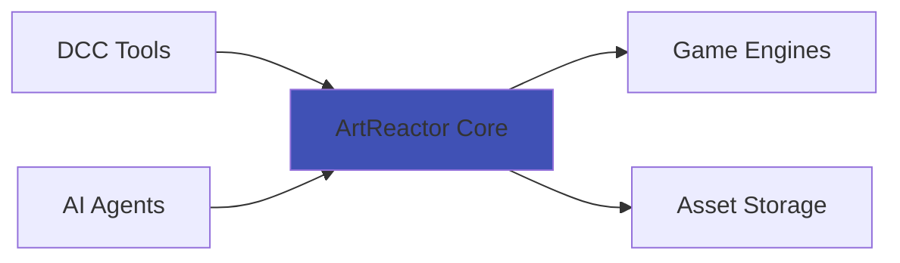

# ArtReactor Core Documentation

Welcome to the **ArtReactor Core** documentation. ArtReactor is a modular, plugin-based framework designed for game asset pipeline automation and inter-application communication.

## What is ArtReactor?

ArtReactor Core is the backbone framework for the Game Asset Pipeline, designed to be extensible and modular. Its primary goal is to allow developers to "write once and expose" functionality for other tools to use, enforced with strict security controls. It facilitates communication between different software and treats Agentic AI as a first-class citizen, enabling complex, cross-application workflows.

## Key Features

- **🔌 Plugin Architecture**: Extend functionality through modular plugins
- **🤖 AI-First Design**: Agents are first-class citizens with tool discovery
- **🔄 Event System**: Decoupled, high-performance event-driven architecture
- **🛠️ CLI Tools**: Comprehensive CLI for service and plugin management
- **🔒 Security Built-In**: Granular permissions and access controls
- **📡 MCP Support**: Model Context Protocol for AI integrations
- **🎮 Pipeline Focused**: Built specifically for game asset workflows

## Quick Links

-   :material-clock-fast:{ .lg .middle } __Getting Started__

    ---

    Get up and running in minutes with installation and quick start guides.

    [:octicons-arrow-right-24: Installation](getting-started/installation.md)

-   :material-puzzle:{ .lg .middle } __Plugin Development__

    ---

    Learn how to create powerful plugins that extend ArtReactor.

    [:octicons-arrow-right-24: Create Plugins](plugin-development/getting-started.md)

-   :material-floor-plan:{ .lg .middle } __Architecture__

    ---

    Understand the core components and how they work together.

    [:octicons-arrow-right-24: Architecture Overview](architecture/overview.md)

-   :material-lightbulb:{ .lg .middle } __Use Cases__

    ---

    Explore real-world scenarios and pipeline integrations.

    [:octicons-arrow-right-24: Use Cases](use-cases/overview.md)

## Who is This For?

### Pipeline Developers
Build robust asset pipelines that integrate DCC tools (Blender, Maya, Photoshop) with game engines (Unreal, Unity).

### Tool Developers
Create reusable tools that can be shared across your studio and integrated with AI agents.

### Technical Artists
Automate repetitive tasks and create custom workflows without deep programming knowledge.

### AI Developers
Build intelligent agents that can orchestrate complex multi-tool workflows.

## Architecture at a Glance

ArtReactor sits at the center of your pipeline, coordinating between:

- **DCC Applications**: Maya, Blender, 3DS Max, Photoshop
- **Game Engines**: Unreal Engine, Unity, Custom Engines
- **AI Agents**: Autonomous workflows and intelligent automation
- **Storage Systems**: Perforce, Git, Network Drives

## Technology Stack

- **Language**: Python 3.10+
- **Framework**: FastAPI
- **Agent Framework**: PydanticAI
- **Package Manager**: uv
- **Supported Platforms**: Windows (primary), Linux, macOS

## Community & Support

- **GitHub**: [josephkirk/ArtReactorCore](https://github.com/josephkirk/ArtReactorCore)
- **Issues**: [Report bugs or request features](https://github.com/josephkirk/ArtReactorCore/issues)
- **Discussions**: [Join the conversation](https://github.com/josephkirk/ArtReactorCore/discussions)

## Next Steps

Ready to get started? Choose your path:

1. **New to ArtReactor?** Start with [Installation](getting-started/installation.md)
2. **Want to build plugins?** Head to [Plugin Development](plugin-development/getting-started.md)
3. **Understanding the design?** Explore the [Architecture](architecture/overview.md)
4. **Looking for examples?** Check out [Use Cases](use-cases/overview.md)
