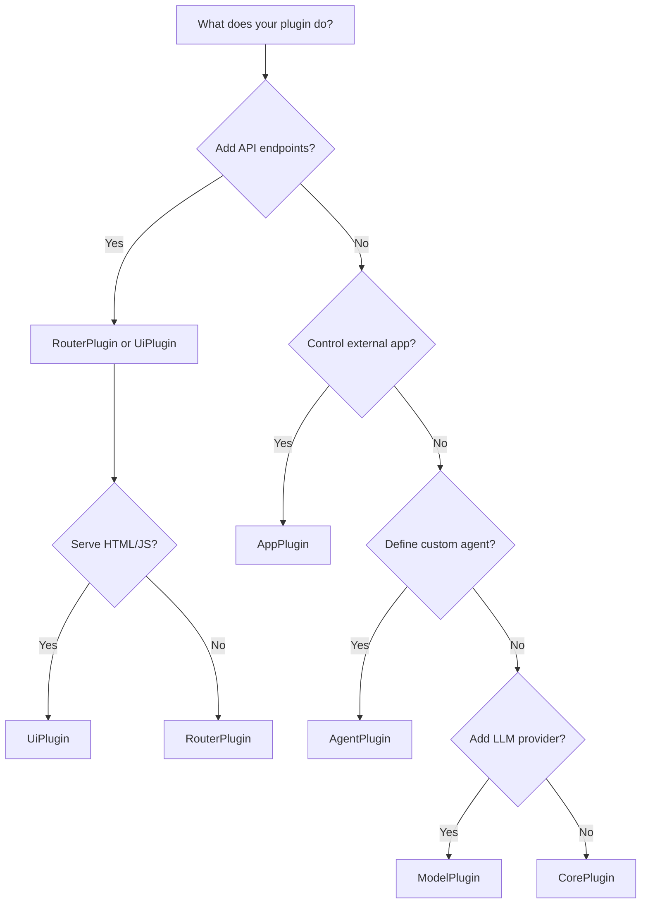

# Plugin Types

ArtReactor supports six plugin types, each designed for specific use cases.

## Quick Reference

| Type | Base Class | Purpose | Use When |
|------|------------|---------|----------|
| **Core** | `CorePlugin` | General functionality | Adding tools, services, or features |
| **Router** | `RouterPlugin` | API endpoints | Exposing REST/MCP endpoints |
| **App** | `AppPlugin` | External applications | Controlling DCC tools or engines |
| **Agent** | `AgentPlugin` | Custom agents | Creating specialized AI agents |
| **Model** | `ModelPlugin` | AI models | Adding custom LLM providers |
| **UI** | `UiPlugin` | Web interfaces | Building dashboards or forms |

## CorePlugin

**Purpose**: General-purpose plugins that extend core functionality.

### When to Use

- Adding new tools for agents
- Background services
- Data processing
- System integrations
- Utilities and helpers

### Example

```python
from artreactor.core.interfaces.plugin import CorePlugin
from artreactor.core.decorators import tool

class FileOperationsPlugin(CorePlugin):
    async def initialize(self):
        self.logger.info("File operations plugin ready")
    
    @tool(name="list_files", description="List files in directory")
    def list_files(self, directory: str) -> list:
        """List all files in the given directory."""
        import os
        return [f for f in os.listdir(directory) if os.path.isfile(f)]
    
    @tool(name="file_size", description="Get file size in bytes")
    def file_size(self, filepath: str) -> int:
        """Get the size of a file."""
        import os
        return os.path.getsize(filepath)
    
    async def shutdown(self):
        self.logger.info("File operations plugin shutting down")
```

### Manifest

```toml
name = "file-operations"
version = "1.0.0"
type = "core"
description = "Provides file system operations"
```

## RouterPlugin

**Purpose**: Add custom API endpoints to the FastAPI server.

### When to Use

- Custom REST APIs
- Webhooks
- MCP protocol endpoints
- Integration endpoints
- Health checks

### Example

```python
from artreactor.core.interfaces.plugin import RouterPlugin
from fastapi import APIRouter, HTTPException
from pydantic import BaseModel

class StatusRequest(BaseModel):
    service: str

class StatusPlugin(RouterPlugin):
    def __init__(self, manifest, context):
        super().__init__(manifest, context)
        self.router = APIRouter(prefix="/status", tags=["status"])
    
    async def initialize(self):
        self._setup_routes()
    
    def _setup_routes(self):
        @self.router.get("/")
        async def get_status():
            return {"status": "healthy", "plugin": "active"}
        
        @self.router.post("/check")
        async def check_service(request: StatusRequest):
            # Check service status
            if request.service == "database":
                return {"service": "database", "status": "connected"}
            raise HTTPException(404, "Service not found")
    
    def get_router(self) -> APIRouter:
        return self.router
    
    async def shutdown(self):
        pass
```

### Manifest

```toml
name = "status-api"
version = "1.0.0"
type = "router"
description = "Provides status API endpoints"
```

### Access Routes

After loading, routes are available at:
- `GET /status/`
- `POST /status/check`

## AppPlugin

**Purpose**: Control external applications like DCC tools or game engines.

### When to Use

- Maya/Blender/3DS Max integration
- Unreal/Unity control
- External tool automation
- Application orchestration

### Example

```python
from artreactor.core.interfaces.plugin import AppPlugin
from artreactor.core.decorators import tool
import subprocess
import socket

class MayaPlugin(AppPlugin):
    def __init__(self, manifest, context):
        super().__init__(manifest, context)
        self.process = None
        self.command_port = 7001
    
    async def launch(self) -> bool:
        """Launch Maya with command port."""
        config = self.context.get("config", {})
        maya_path = config.get("plugins", {}).get("maya", {}).get("settings", {}).get("maya_path")
        
        if not maya_path:
            self.logger.error("Maya path not configured")
            return False
        
        try:
            # Launch Maya with command port enabled
            self.process = subprocess.Popen([
                maya_path,
                "-command", f"commandPort -name ':{self.command_port}'"
            ])
            self.logger.info(f"Maya launched (PID: {self.process.pid})")
            return True
        except Exception as e:
            self.logger.error(f"Failed to launch Maya: {e}")
            return False
    
    async def execute_code(self, code: str) -> dict:
        """Execute MEL or Python code in Maya."""
        try:
            # Connect to Maya command port
            sock = socket.socket(socket.AF_INET, socket.SOCK_STREAM)
            sock.connect(("localhost", self.command_port))
            
            # Send code
            sock.sendall(code.encode('utf-8'))
            
            # Receive result
            result = sock.recv(4096).decode('utf-8')
            sock.close()
            
            return {"status": "success", "result": result}
        except Exception as e:
            return {"status": "error", "message": str(e)}
    
    @tool(name="maya_export", description="Export from Maya")
    async def maya_export(self, filepath: str, format: str = "fbx") -> dict:
        """Export file from Maya."""
        code = f'file -export -type "{format}" "{filepath}";'
        return await self.execute_code(code)
    
    async def shutdown(self):
        if self.process:
            self.process.terminate()
```

### Manifest

```toml
name = "maya-integration"
version = "1.0.0"
type = "app"
description = "Controls Autodesk Maya"

[settings]
maya_path = "C:/Program Files/Autodesk/Maya2024/bin/maya.exe"
```

## AgentPlugin

**Purpose**: Define specialized AI agents with custom prompts and tool access.

### When to Use

- Domain-specific agents
- Restricted tool access
- Custom system prompts
- Specialized behaviors

### Example

```python
from artreactor.core.interfaces.agent_plugin import AgentPlugin
from typing import List

class AssetProcessorAgent(AgentPlugin):
    @property
    def agent_type(self) -> str:
        """Unique identifier for this agent type."""
        return "asset_processor"
    
    @property
    def model_id(self) -> str:
        """LLM model to use."""
        return "gpt-4"
    
    @property
    def system_prompt(self) -> str:
        """Custom system prompt."""
        return """You are an expert game asset processor. Your role is to:
        
        1. Validate asset naming conventions
        2. Ensure correct export settings
        3. Optimize assets for game engines
        4. Maintain asset pipeline standards
        
        Always verify settings before export.
        Ask for clarification if requirements are ambiguous.
        """
    
    @property
    def tool_names(self) -> List[str]:
        """Tools this agent can use."""
        return [
            "validate_asset",
            "export_mesh",
            "optimize_texture",
            "check_polycount",
            "generate_lods"
        ]
    
    async def initialize(self):
        self.logger.info("Asset processor agent initialized")
    
    async def shutdown(self):
        pass
```

### Manifest

```toml
name = "asset-processor-agent"
version = "1.0.0"
type = "agent"
description = "Specialized agent for asset processing"
```

### Using Custom Agents

```python
response = requests.post(
    "http://127.0.0.1:8000/api/agent/run",
    json={
        "prompt": "Export character model with LODs",
        "agent_type": "asset_processor"
    }
)
```

## ModelPlugin

**Purpose**: Provide custom AI model integrations.

### When to Use

- Custom LLM providers
- Local models (Ollama, LM Studio)
- Specialized models
- Custom embedding models

### Example

```python
from artreactor.core.interfaces.model_plugin import ModelPlugin

class LocalLLMPlugin(ModelPlugin):
    @property
    def model_id(self) -> str:
        return "local-llama"
    
    @property
    def provider(self) -> str:
        return "ollama"
    
    @property
    def model_config(self) -> dict:
        return {
            "model": "llama2",
            "base_url": "http://localhost:11434",
            "temperature": 0.7,
            "max_tokens": 2000
        }
    
    async def initialize(self):
        # Verify Ollama is running
        import aiohttp
        try:
            async with aiohttp.ClientSession() as session:
                async with session.get("http://localhost:11434/api/tags") as resp:
                    if resp.status == 200:
                        self.logger.info("Ollama connection verified")
                    else:
                        self.logger.warning("Ollama not responding")
        except Exception as e:
            self.logger.error(f"Failed to connect to Ollama: {e}")
    
    async def shutdown(self):
        pass
```

### Manifest

```toml
name = "local-llm"
version = "1.0.0"
type = "model"
description = "Local LLM via Ollama"
```

## UiPlugin

**Purpose**: Serve web-based user interfaces.

### When to Use

- Admin dashboards
- Configuration interfaces
- Visualization tools
- Interactive forms
- Monitoring panels

### Example

```python
from artreactor.core.interfaces.plugin import UiPlugin
from fastapi import APIRouter
from fastapi.responses import HTMLResponse, FileResponse
from pathlib import Path

class DashboardPlugin(UiPlugin):
    def __init__(self, manifest, context):
        super().__init__(manifest, context)
        self.static_dir = Path(__file__).parent / "static"
        self.router = APIRouter(prefix="/dashboard")
    
    async def initialize(self):
        self._setup_routes()
    
    def _setup_routes(self):
        @self.router.get("/", response_class=HTMLResponse)
        async def serve_dashboard():
            return """
            <!DOCTYPE html>
            <html>
            <head>
                <title>ArtReactor Dashboard</title>
            </head>
            <body>
                <h1>ArtReactor Dashboard</h1>
                <div id="stats">
                    <p>Active Plugins: <span id="plugin-count">0</span></p>
                    <p>Registered Tools: <span id="tool-count">0</span></p>
                </div>
                <script src="/dashboard/static/app.js"></script>
            </body>
            </html>
            """
        
        @self.router.get("/static/{filename}")
        async def serve_static(filename: str):
            file_path = self.static_dir / filename
            if file_path.exists():
                return FileResponse(file_path)
            return {"error": "File not found"}
        
        @self.router.get("/api/stats")
        async def get_stats():
            pm = self.context.get("plugin_manager")
            am = self.context.get("agent_manager")
            return {
                "plugins": len(pm.plugins) if pm else 0,
                "tools": len(am.tools) if am else 0
            }
    
    def get_router(self) -> APIRouter:
        return self.router
    
    async def shutdown(self):
        pass
```

### Manifest

```toml
name = "dashboard-ui"
version = "1.0.0"
type = "ui"
description = "Web-based dashboard interface"
```

## Choosing the Right Type

### Decision Tree



### Common Patterns

| Scenario | Recommended Type |
|----------|------------------|
| Add tools for agents | CorePlugin |
| REST API endpoints | RouterPlugin |
| Control Maya/Blender | AppPlugin |
| Asset validation agent | AgentPlugin |
| Local LLM integration | ModelPlugin |
| Admin dashboard | UiPlugin |
| File operations | CorePlugin |
| Webhooks | RouterPlugin |
| Unreal Engine control | AppPlugin |

## Combining Multiple Types

You can create plugins that implement multiple types:

```python
# Plugin that provides both tools and API
class HybridPlugin(CorePlugin, RouterPlugin):
    @tool(name="process")
    def process(self, data: str) -> str:
        return f"Processed: {data}"
    
    def get_router(self) -> APIRouter:
        router = APIRouter(prefix="/hybrid")
        
        @router.get("/status")
        async def status():
            return {"status": "ok"}
        
        return router
```

## Next Steps

- [Creating Plugins](creating-plugins.md) - Detailed creation guide
- [Tools and Decorators](tools-and-decorators.md) - Advanced tool patterns
- [Best Practices](best-practices.md) - Production-ready development
