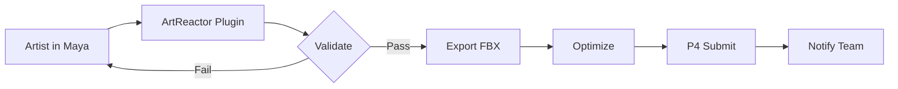
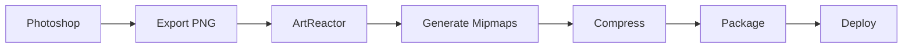
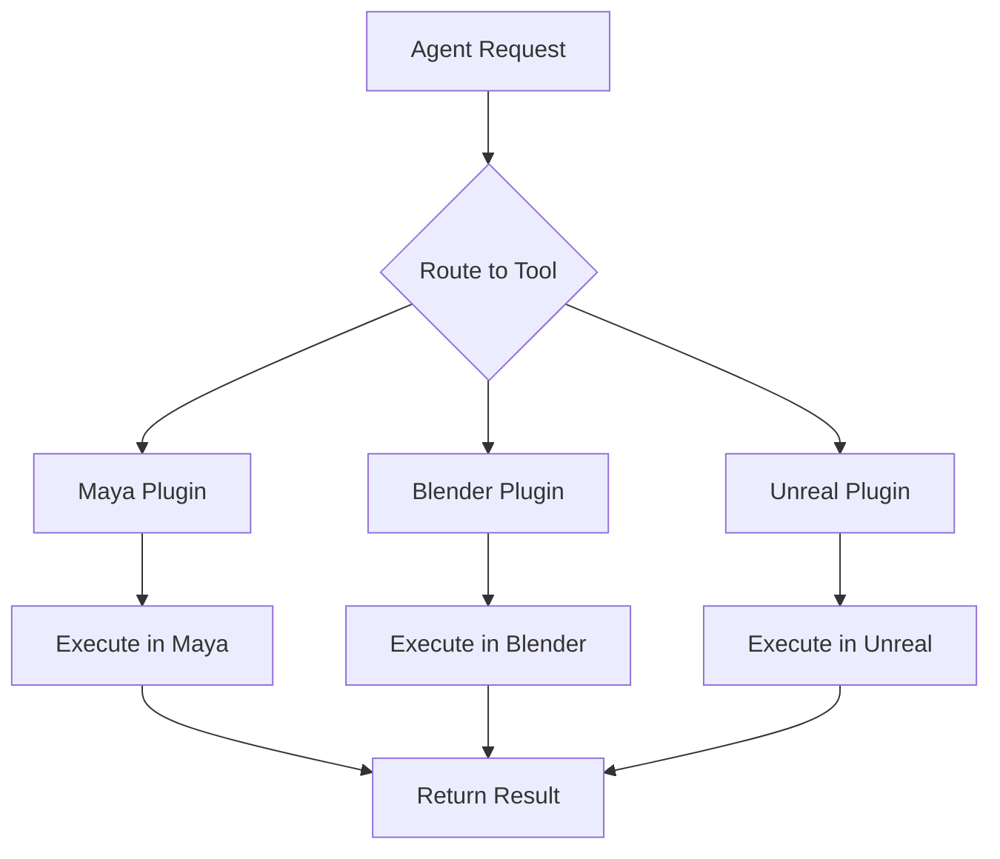

# Use Cases Overview

ArtReactor Core is designed for game asset pipeline automation. Here are the primary use cases and scenarios where ArtReactor excels.

## Primary Use Cases

### 1. Game Asset Pipeline Automation

Automate the flow of assets from Digital Content Creation (DCC) tools to game engines.

**Example Workflow**:
```
3D Artist in Maya → Export FBX → Process Textures → Import to Unreal → Set Materials
```

**With ArtReactor**:
- One-click export from Maya with validation
- Automatic texture optimization
- Auto-import into Unreal with correct settings
- Material assignment based on naming conventions
- Version control integration

[Learn More →](game-asset-pipeline.md)

### 2. DCC Tool Integration

Connect multiple DCC applications in a unified pipeline.

**Supported Tools**:
- **3D**: Maya, Blender, 3DS Max, Houdini
- **2D**: Photoshop, Substance Painter, GIMP
- **Engines**: Unreal Engine, Unity

**Capabilities**:
- Remote command execution
- File format conversion
- Data synchronization
- Live updates

[Learn More →](dcc-integration.md)

### 3. Agentic Workflows

Use AI agents to orchestrate complex, multi-step processes.

**Example**:
> "Export all modified character models from Maya, optimize their textures, and import them into Unreal with LODs configured."

The agent:
1. Queries version control for modified files
2. Opens Maya and exports each model
3. Runs texture optimization tools
4. Opens Unreal and imports assets
5. Configures LOD settings
6. Commits changes back to version control

[Learn More →](agentic-workflows.md)

## Common Scenarios

### Asset Export Pipeline



### Texture Processing Pipeline



### Cross-Application Workflow



## Real-World Examples

### Example 1: Character Asset Pipeline

**Scenario**: Export rigged character from Maya to Unreal

**Tools Involved**:
- Maya (modeling/rigging)
- ArtReactor (orchestration)
- Perforce (version control)
- Unreal Engine (game engine)

**Workflow**:
1. Artist completes character in Maya
2. Runs validation tool (naming, bone count, skin weights)
3. Export FBX with correct settings
4. Auto-check out in Perforce
5. Import into Unreal with animation setup
6. Submit to Perforce with description

**Agent Prompt**:
> "Export the character 'Hero_Male_01' from Maya to Unreal with animations"

### Example 2: Environment Asset Batch Processing

**Scenario**: Process 100+ environment props

**Challenge**: Manual processing takes hours

**Solution with ArtReactor**:
- Agent identifies all props needing processing
- Batch export from Blender
- Parallel texture optimization
- Generate LODs automatically
- Import to Unity with correct prefab settings
- All completed in minutes

### Example 3: Daily Build Asset Preparation

**Scenario**: Prepare assets for nightly build

**Automated Steps**:
1. Query P4 for assets modified today
2. Validate each asset
3. Re-export any with incorrect settings
4. Run optimization passes
5. Update asset database
6. Generate build manifest
7. Send report to team

**Scheduled Execution**:
```bash
# Cron job
0 18 * * * arte run-agent "Prepare assets for tonight's build"
```

## Studio Integration Patterns

### Pattern 1: Centralized Service

Deploy ArtReactor as a studio-wide service.

**Benefits**:
- Single source of truth for pipelines
- Centralized logging and monitoring
- Shared plugin library
- Easy updates

**Setup**:
```
Server: ArtReactor Core (always running)
Clients: DCC Plugins (connect to server)
Agents: Can be triggered by anyone
```

### Pattern 2: Per-Artist Instance

Each artist runs their own ArtReactor instance.

**Benefits**:
- No network dependency
- Customizable per artist
- Offline capable
- Faster for local operations

**Setup**:
```bash
# Each artist's machine
arte start --config studio-config.toml
```

### Pattern 3: Hybrid Approach

Local instances + central orchestrator.

**Benefits**:
- Best of both worlds
- Local for speed, central for coordination
- Shared tools, local execution

## Performance Characteristics

### Asset Processing

| Operation | Time (Single) | Time (Batch 100) |
|-----------|--------------|------------------|
| FBX Export | 2-5s | 3-8 min |
| Texture Optimize | 1-3s | 2-5 min |
| Engine Import | 3-10s | 5-15 min |
| Full Pipeline | 10-20s | 10-30 min |

### Scalability

- **Concurrent Operations**: 10-50 depending on hardware
- **Plugin Count**: 100+ plugins without performance impact
- **Event Throughput**: 100k+ events/second
- **Agent Calls**: Limited by LLM provider rate limits

## Security Considerations

### Studio Network

- Run on isolated network segment
- Use API keys for authentication
- Encrypt sensitive configuration
- Audit all file operations

### Source Control Integration

- Use service accounts for P4/Git
- Never store passwords in configs
- Implement checkout/submit permissions
- Log all version control operations

### External API Access

- Whitelist allowed domains
- Rate limit external requests
- Validate all inputs
- Sanitize file paths

## Next Steps

Explore specific use cases:

1. [Game Asset Pipeline](game-asset-pipeline.md) - Detailed pipeline examples
2. [DCC Integration](dcc-integration.md) - How to integrate specific tools
3. [Agentic Workflows](agentic-workflows.md) - Building intelligent automations
